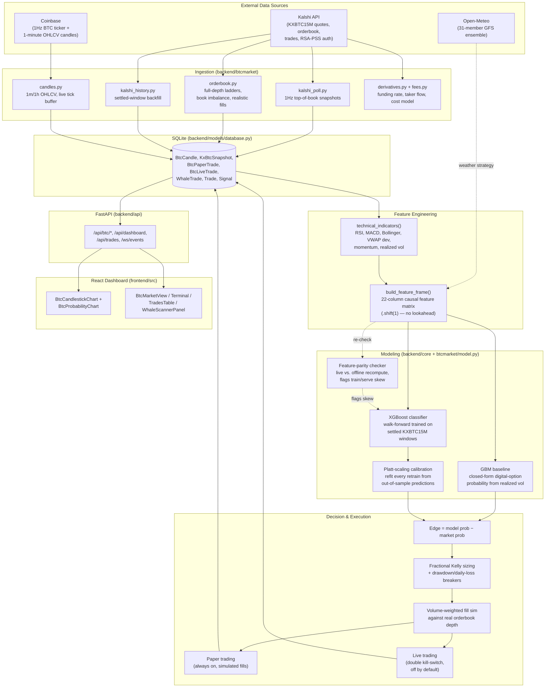

# Kalshi Trading Bot

A trading bot for [Kalshi](https://kalshi.com) prediction markets. Its main focus is **KXBTC15M** — Kalshi's 15-minute Bitcoin up/down binary markets — priced with a closed-form volatility model *and* a trained gradient-boosted classifier, walk-forward validated and probability-calibrated before a single dollar (paper or real) ever touches it. It also includes a Kalshi-wide **whale trade scanner** and a legacy **weather temperature strategy** (Kalshi KXHIGH + ensemble forecasting), all surfaced through a live terminal-style React dashboard.

     

> **Safety-first by design.** Every strategy starts in simulation/paper mode. Real order placement requires **two independent switches** to both be on — a code-level config flag *and* a runtime database flag — so nothing trades with real money by accident. See [Safety & Kill Switches](#safety--kill-switches).

## Table of Contents

- [Who This Is For](#who-this-is-for)
- [Key Features](#key-features)
- [Quick Start](#quick-start)
- [Architecture](#architecture)
- [How the BTC Model Works](#how-the-btc-model-works)
- [Other Strategies](#other-strategies)
- [Dashboard](#dashboard)
- [API Reference](#api-reference)
- [Configuration](#configuration)
- [Project Structure](#project-structure)
- [Safety & Kill Switches](#safety--kill-switches)
- [Disclaimer](#disclaimer)

## Who This Is For

- **Quant / ML practitioners** who want a real, working example of pricing a short-horizon binary option with both a closed-form baseline (GBM) and a trained classifier — including walk-forward CV, probability calibration, and a train/serve parity safety net, not just a toy notebook.
- **Kalshi API users** who want a working reference for RSA-PSS request signing, rate-limit backoff, orderbook depth fetching, and realistic (volume-weighted) fill simulation against real order books.
- **Systematic traders** who want to check whether a market has real edge before risking capital — the whole pipeline paper-trades first, logs its reasoning for every decision, and reports calibration (Brier score with confidence intervals) rather than assuming a backtest number.
- **Anyone curious how a 15-minute crypto prediction market actually behaves** — the dashboard visualizes live order flow, model-vs-market probability, and settlement outcomes in real time.

## Key Features

### BTC 15-Minute Market (KXBTC15M) — the core strategy
- **Two pricing models, cross-checked against each other**: a zero-drift geometric Brownian motion (digital-option) closed form, and a trained **XGBoost** classifier over 22 engineered features.
- **Walk-forward validation, never in-sample**: the model is retrained on a rolling basis and evaluated only on chronologically later, unseen windows.
- **Platt-scaled probability calibration**, refit every retrain cycle from out-of-sample predictions — boosted-tree outputs are not calibrated probabilities by default, so this is applied before any trading decision.
- **Realistic fill simulation**: paper and live trades price against the *actual* volume-weighted orderbook ladder, not the quoted mid, so slippage is real and measured, not assumed away.
- **Feature-parity safety net**: an automated job compares every live-computed feature against what the offline training pipeline would have computed for the same trade, to catch train/serve skew bugs automatically instead of waiting for performance to mysteriously degrade.
- **Quote-staleness and order-flow features**: `quote_age_seconds`/`btc_move_since_quote` (does the book actually reflect the current price?), order-book imbalance, short-horizon momentum, RSI/MACD/Bollinger/VWAP, trailing settlement bias, and cyclical hour-of-day encoding.
- **Fractional-Kelly position sizing** (0.15×, validated against literature for high-variance near-50/50 markets) with hard per-trade and drawdown-from-peak circuit breakers.
- **Kalshi rate-limit resilience**: automatic 429 retry with `Retry-After` honoring and exponential backoff.

### Whale Scanner
Watches Kalshi's public trade firehose across **every** market for fills above a configurable notional threshold, persisting them to SQLite + CSV — a live feed of where real size is actually trading.

### Weather Strategy (legacy, dormant by default)
31-member GFS ensemble forecasts (Open-Meteo) vs. Kalshi's `KXHIGH*` temperature markets, with signal-confirmation windows, Discord alerts, and the same Kelly-sizing/circuit-breaker discipline as the BTC strategy.

### Dashboard
A dark, Bloomberg-terminal-style React dashboard: live BTC candlestick + model-probability charts, a signals/trades table, equity curve, calibration panel, whale scanner feed, and a running event log — all polling a FastAPI backend over REST (with a WebSocket event stream).

## Quick Start

### Prerequisites
- Python 3.10+
- Node 18+
- A [Kalshi](https://kalshi.com) account and API key (optional for read-only/paper use of most features, required for real orders and for weather/whale market data)

### 1. Backend

```bash
git clone <this-repo>
cd kalshi-bot

python -m venv venv
source venv/bin/activate      # Windows: venv\Scripts\activate

pip install -r requirements.txt

# Optional: create a .env file for Kalshi credentials
# KALSHI_API_KEY_ID=...
# KALSHI_PRIVATE_KEY_PATH=./kalshi_private_key.pem

uvicorn backend.api.main:app --reload --port 8000
```

Backend: http://localhost:8000 · Interactive API docs: http://localhost:8000/docs

On first startup the server checks all external APIs, backfills recent BTC candles and KXBTC15M history, and trains an initial model if no artifact exists yet — this can take a minute or two the very first time.

### 2. Frontend

```bash
cd frontend
npm install
npm run dev
```

Frontend: http://localhost:5173 — open it and switch to the **BTC 15M** tab to watch the live model.

### It's paper-trading by default

`BTC_PAPER_TRADING_ENABLED=True` and `BTC_LIVE_TRADING_ENABLED=False` out of the box. The bot will price, log, and simulate trades against real market data with zero risk until you deliberately flip both live-trading switches (see [Safety & Kill Switches](#safety--kill-switches)).

## Architecture



**The scheduler** (`backend/core/scheduler.py`, APScheduler) drives all of this on independent cadences: 1Hz price/orderbook polling, 5s depth snapshots, 15s signal checks, 60s paper settlement, 6h model retraining, and a 3h feature-parity audit — each job logs to `bot.log` with throttled warnings so a silent failure is never invisible.

## How the BTC Model Works

**The question every KXBTC15M contract asks**: *"Will BTC-USD be at or above `$K` when this 15-minute window closes?"*

### 1. Closed-form baseline (GBM)
Because every window only differs by strike, time-to-close, and recent volatility, a driftless geometric Brownian motion gives the right functional shape for free:

```
ln(S_T / S_0) ~ Normal(-0.5·σ_h², σ_h²)          σ_h = σ_per_second · √(seconds_remaining)
P(YES) = Φ( (ln(S_0/K) − 0.5·σ_h²) / σ_h )
```

`σ_per_second` is estimated from realized volatility of trailing 1-minute Coinbase closes. Drift is deliberately fixed at zero — at a 15-minute horizon, any momentum estimate is mostly noise, and baking noise into the exponent makes the model worse, not better.

### 2. Trained classifier (XGBoost)
A gradient-boosted classifier is trained on every settled KXBTC15M window, using 22 causal (no-lookahead) features: distance-to-strike, time remaining, the GBM probability itself, realized volatility, short/medium-term momentum, cumulative volume, hourly range, quote staleness (`quote_age_seconds`, `btc_move_since_quote` — is the book actually current?), path efficiency, hour-of-day (cyclically encoded), RSI/MACD/Bollinger/VWAP deviation, and trailing settlement bias.

- **Walk-forward, not k-fold**: folds are split strictly by chronological window order — training only ever sees earlier windows than it's tested on.
- **Platt-scaling calibration** is fit on aggregated out-of-sample predictions each retrain, since boosted trees are known to produce systematically miscalibrated raw probabilities.
- **A feature-parity job** independently recomputes each live trade's features offline and diffs them against what was used live — this is how two real train/serve skew bugs (a volume=0 candle regression, a `merge_asof` column-collision bug) were caught in this project's own history.

### 3. Turning a probability into a trade
```
edge = model_probability − market_probability
kelly = (win_prob·odds − lose_prob) / odds
position_size = kelly × 0.15 (fractional Kelly) × bankroll, capped
```
A trade only fires if `|edge|` clears the configured threshold **and** the fill price (from the real, volume-weighted orderbook, not the quoted mid) stays within bounds. Every decision — taken or not — is logged with its full reasoning.

## Other Strategies

**Weather (KXHIGH series)** — dormant by default (`WEATHER_BOT_ENABLED=False`). Pulls a 31-member GFS ensemble forecast per city from Open-Meteo, counts the fraction of members above/below a market's temperature threshold as the model probability, and trades Kalshi's `KXHIGHNY`/`KXHIGHCHI`/`KXHIGHMIA`/`KXHIGHLAX`/`KXHIGHDEN` markets when edge clears 8%, with a multi-minute signal-confirmation window before acting.

**Whale Scanner** — always-on by default. Polls Kalshi's trade firehose across all markets, flags fills over `$1,000` notional, and writes them to both the database and a CSV for offline analysis of where real size is trading.

## Dashboard

Four views, one FastAPI backend:

| View | What it shows |
|---|---|
| **Dashboard** | Bankroll, P&L, win rate, equity curve, calibration (accuracy + Brier score), weather signals table, ensemble forecast cards, trade history, live event terminal |
| **BTC 15M** | Live KXBTC15M candlestick chart, model-vs-market probability chart, current window/strike/spot, paper-trading stats |
| **Backtest** | Walk-forward and holdout evaluation results for the BTC model |
| **Whales** | Real-time large-trade feed across all Kalshi markets |

## API Reference

### BTC market (`/api/btc/*`)
| Endpoint | Method | Description |
|---|---|---|
| `/api/btc/candles` | GET | OHLCV candles (`interval`: 1m–1d, `lookback`: 1d–1m) |
| `/api/btc/market` | GET | Current open KXBTC15M market + latest snapshot |
| `/api/btc/history` | GET | Recorded YES/NO probability history |
| `/api/btc/kalshi-candles` | GET | Real OHLC candles of the KXBTC15M YES price across rotating windows |
| `/api/btc/signal` | GET | Current GBM model probability vs. live market price |
| `/api/btc/train-model` | GET | Trigger a walk-forward retrain |
| `/api/btc/paper-trading` | GET | Paper-trading performance report (win rate, PnL, Brier + CI) |
| `/api/btc/holdout-eval` | GET | One-shot forward evaluation on genuinely held-out data |
| `/api/btc/feature-parity` | GET | Live-vs-offline feature drift report |

### General
| Endpoint | Method | Description |
|---|---|---|
| `/api/dashboard` | GET | All dashboard data in one call |
| `/api/stats` | GET | Bot performance stats |
| `/api/trades` | GET | Trade history |
| `/api/equity-curve` | GET | Bankroll over time |
| `/api/calibration` | GET | Prediction calibration (accuracy, Brier) |
| `/api/kalshi/status` | GET | Kalshi auth status + balance |
| `/api/weather/forecasts` / `/api/weather/signals` | GET | Ensemble forecasts / weather trading signals |
| `/api/whales` / `/api/whales/stats` | GET | Whale trade feed + summary stats |
| `/api/backtest/nyc` | GET | Weather-strategy historical backtest |
| `/api/run-scan` | POST | Trigger a manual weather scan |
| `/api/settle-trades` | POST | Manually check settlements |
| `/api/whales/scan` | POST | Trigger a manual whale scan |
| `/api/bot/start` / `/api/bot/stop` / `/api/bot/reset` | POST | Control the weather bot loop |
| `/api/events` | GET | Recent event log |
| `/ws/events` | WS | Real-time event stream |

Full interactive docs at `/docs` once the server is running.

## Configuration

All settings live in `backend/config.py`, overridable via a `.env` file. The most important ones:

### Kalshi
| Setting | Default | Description |
|---|---|---|
| `KALSHI_API_KEY_ID` / `KALSHI_PRIVATE_KEY_PATH` | `None` | RSA-PSS API credentials |
| `KXBTC15M_SERIES_TICKER` | `KXBTC15M` | Kalshi series to track |

### BTC strategy
| Setting | Default | Description |
|---|---|---|
| `BTC_MARKET_ENABLED` | `True` | Master switch for BTC data ingestion |
| `BTC_PAPER_TRADING_ENABLED` | `True` | Simulated trading (no real orders, ever) |
| `BTC_PAPER_INITIAL_BANKROLL` | `50.0` | Paper bankroll |
| `KELLY_FRACTION` | `0.15` | Fractional Kelly multiplier |
| `MIN_EDGE_THRESHOLD` | `0.02` | Minimum edge to act on |
| `BTC_RETRAIN_INTERVAL_SECONDS` | `21600` | Retrain cadence (6h) |
| `BTC_LIVE_TRADING_ENABLED` | `False` | **Real-money switch #1** — see below |

### Weather & whales
| Setting | Default | Description |
|---|---|---|
| `WEATHER_BOT_ENABLED` | `False` | Master switch for the weather strategy |
| `WHALE_SCANNER_ENABLED` | `True` | Whale trade monitoring |
| `MIN_WHALE_TRADE_USD` | `1000.0` | Whale alert threshold |

### Risk management
| Setting | Default | Description |
|---|---|---|
| `DAILY_LOSS_LIMIT` | `300.0` | Daily loss circuit breaker |
| `MAX_TOTAL_PENDING_TRADES` | `20` | Max concurrent open positions |
| `SIMULATION_MODE` | `True` | Global real-order kill switch |

## Project Structure

```
kalshi-bot/
├── backend/
│   ├── api/
│   │   ├── main.py                    # FastAPI app, dashboard/weather/whale routes, WebSocket
│   │   └── btc_routes.py              # BTC-specific routes (candles, market, signal, training)
│   ├── btcmarket/                     # KXBTC15M data + pricing module
│   │   ├── candles.py                 #   1m/1h OHLCV candles, live tick buffer, short-horizon momentum
│   │   ├── kalshi_poll.py             #   1Hz top-of-book snapshot polling
│   │   ├── kalshi_history.py          #   Settled-window backfill into real historical candles
│   │   ├── orderbook.py               #   Full-depth ladders, book imbalance, realistic fill simulation
│   │   ├── derivatives.py             #   Funding rate / perp positioning signals
│   │   ├── fees.py                    #   Trading cost model
│   │   ├── model.py                   #   Closed-form GBM digital-option probability model
│   │   └── artifacts/                 #   Trained model + calibration JSON artifacts
│   ├── core/
│   │   ├── scheduler.py               #   APScheduler jobs for every strategy, throttled logging
│   │   ├── btc_model_training.py      #   Feature engineering + walk-forward XGBoost training
│   │   ├── btc_paper_trading.py       #   Live feature build, paper trade generation + settlement
│   │   ├── btc_live_trading.py        #   Real-order execution path (double kill-switch gated)
│   │   ├── btc_entry_timing_backtest.py # Entry-timing strategy backtesting harness
│   │   ├── btc_feature_parity.py      #   Live-vs-offline feature drift checker
│   │   ├── btc_walkforward_equity.py  #   Walk-forward equity curve simulation
│   │   ├── weather_signals.py         #   Ensemble-vs-market weather signal generation
│   │   ├── backtest.py / settlement.py #  Weather backtest + trade settlement engine
│   ├── data/
│   │   ├── kalshi_client.py           #   RSA-PSS signed Kalshi API client, 429 retry/backoff
│   │   ├── kalshi_markets.py          #   Kalshi weather market fetcher (KXHIGH)
│   │   └── weather.py                 #   Open-Meteo ensemble + NWS observations
│   ├── scanner/
│   │   ├── whale_scanner.py           #   Cross-market large-trade monitor
│   │   └── kalshi_api.py              #   Shared Kalshi scanner client
│   ├── models/database.py             #   SQLAlchemy models (candles, snapshots, trades, whales)
│   └── config.py                      #   All settings (env-overridable)
├── frontend/
│   └── src/
│       ├── components/
│       │   ├── BtcMarketView.tsx      #   BTC 15M tab layout
│       │   ├── BtcCandlestickChart.tsx#   Live OHLC candlestick chart
│       │   ├── BtcProbabilityChart.tsx#   Model-vs-market probability chart
│       │   ├── WhaleScannerPanel.tsx  #   Whale trade feed
│       │   ├── BacktestPanel.tsx      #   Backtest results view
│       │   ├── EquityChart.tsx / CalibrationPanel.tsx / TradesTable.tsx / Terminal.tsx
│       ├── App.tsx                    #   Dashboard shell + view routing
│       ├── api.ts                     #   Backend API client
│       └── types.ts                   #   Shared TypeScript types
├── entry_points.md                    # Recorded research on BTC entry-timing experiments
├── prior_findings.md                  # Log of external research and what it changed in the code
├── requirements.txt
└── README.md
```

## Safety & Kill Switches

Nothing in this repo places a real order without **two independent conditions both being true**:

1. **`BTC_LIVE_TRADING_ENABLED`** (or `SIMULATION_MODE=False` for weather) — a code-level flag in `backend/config.py` / `.env`, requiring a deploy to change.
2. **A runtime database flag** (`BtcLiveTradingState.enabled`) — toggleable without a deploy, the actual last-mile kill switch.

On top of that: a **daily loss limit**, a **drawdown-from-peak circuit breaker** (halts if balance falls >25% below its recorded peak), and a **max-pending-trades** cap all gate live execution independently. Paper trading has no such restrictions because it never touches real funds — it exists specifically so the model's edge can be observed honestly before any switch is flipped.

## Disclaimer

This project is for **educational and research purposes**. Paper trading and backtests do not guarantee live performance — this repo's own research log (`prior_findings.md`) documents real, measured gaps between backtested and live Brier scores and the bugs found while investigating them. Prediction markets carry real risk of loss. Nothing here is financial advice.

## License

MIT — do whatever you want with it.
